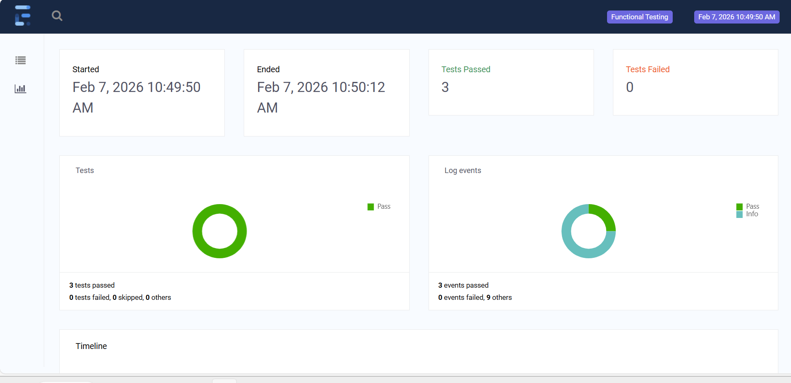
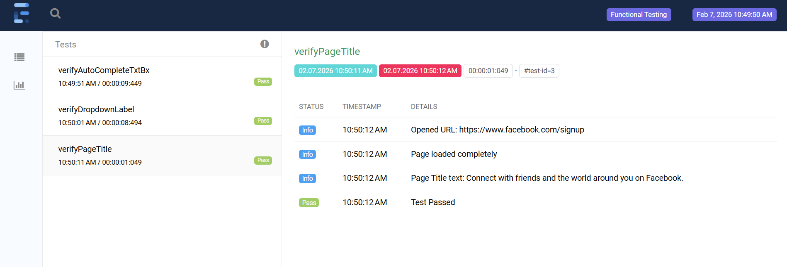

# **Selenium-WebDriver**
## 👋 **Introduction & Why selenium?**
Selenium WebDriver is a tool that allows you to automate web browsers using code, making it easier to test web applications and perform repetitive tasks. It supports multiple programming languages like Java, Python, and JavaScript, and works across various browsers such as Chrome, Firefox, and Edge. You can learn more and get started at selenium.dev.

## Test Report




[Click here to view full report](https://bija510.github.io/selenium-maven-java/#)

### ✨ Key Features:
***

**Selenium WebDriver** is a programming interface developed by **Simon Stewart in 2006**.

- **Cross-Platform Support**: Works on **Windows**, **Mac**, and **Linux**.
- **Cross-Browser Support**: Compatible with major browsers like **Chrome**, **Microsoft Edge**, **Firefox**, and **Safari**.

- **Multi-Language Support**: Works with top programming languages including **Java**, **JavaScript**, **Python**, **C#**, and **Ruby**.

- Use **Eclipse IDE** to develop and manage test cases.

- Integrates with **Jenkins** for **CI/CD** pipeline automation.

- Supports **Maven** for build and dependency management.

- Use **Git** (version control) and **GitHub** (cloud-based repository hosting) for collaboration.

- Supports **TestNG** as a testing framework.

- Huge ecosystem of plugins – offering flexibility and enhanced capabilities.

- Generates HTML test reports using **Maven**, **TestNG**, **Extent Reports**, and **Allure Reports**.

***


## 📥 Download, Install and Setup.
#### Eclipse IDE Download 
- https://www.eclipse.org/downloads/packages/

#### Install TestNG in Eclipse  
- Help >> Eclipse Market place >> search >> testng >> Install.

#### Install Java JDK
1. Download the **x64 Installer (.exe)** from [Oracle JDK Downloads](https://www.oracle.com/java/technologies/downloads/#jdk21-windows).
2. Run the installer and complete the setup.
3. Set environment variables:
	- Open This **PC > Properties > Advanced system settings > Environment Variables.**
	- Under System variables, create a new variable:
	  `JAVA_HOME = C:\Program Files\Java\jdk-21`
	- Edit the Path variable and add:
	 `C:\Program Files\Java\jdk-21\bin`
4. Verify installation by running in Command Prompt: `java --version`

#### Install Apache Maven
1. Download the **Binary zip archive** (`apache-maven-3.9.9-bin.zip`) from [Apache Maven Downloads](https://maven.apache.org/download.cgi).
2. Extract the zip file to a desired location, e.g., `C:\Program Files\apache-maven-3.9.9`.
3. Set environment variables:  
   - Right-click **This PC** → **Properties** → **Advanced system settings** → **Environment Variables**.  
   - Under **User variables**, create a new variable:  
     `MAVEN_HOME = C:\Program Files\apache-maven-3.9.9`  
   - Edit the **Path** variable under **System variables** and add:  
     `C:\Program Files\apache-maven-3.9.9\bin`
4. Verify installation by running in Command Prompt:  

#### For the pom.xml dependencies
- https://mvnrepository.com/

## 📘 Naming conventions for Selenium identifiers
| UI Control Type | Example Naming | UI Control Type | Example Naming |
|-----------------|----------------|-----------------|----------------|
| Button | btnSubmit | Form | frmLogin |
| Text Box / Input | txtUsername | Image / Icon | imgLogo |
| Check Box | chkRememberMe | Dialog / Modal | dlgConfirm |
| Radio Button | radGender | List / Listbox | lstItems |
| Label / Text | lblMessage | Text Area | txaComments |
| Date Picker | dtpStartDate | Panel / Section | pnlProfile |
| Link / Anchor | lnkForgotPassword | Data Grid | grdResults |
| Dropdown / Select | ddlCountry | Tabs | tabDashboard |
| Combo Box | cboSearch | Slider | sldVolume |
| Menu / Navigation | mnuSettings | Tree View | treCategory |
| Table | tblUsers |  |  |


# 🗂️ Folder Structure
```
src/main/java
├── com.qa.utils
    └── Base.java
    └── CommonUtils.java
    └── ExcelUtils.java
    └── ExtendReportManager.java
    └── SeleniumUtils.java
    └── PdfReader.java
    └── log4j2.xml


src/test/java
├── tests
    └── LoginTest.java
├── pages
    └── LoginPage.java

Configurations
├── Config.properties

Data
├── TestData.json

Include
├── UploadFile.pdf, UploadFile.png, UploadFile.csv...
├── SelectorHub.crx (browser extension)

Logs
├── execution.logs

reports
├── extendReport.html

Screenshots
├── assertDemo0313_Failed_183355.png

target (Maven Report)
├── surefire-reports
    └──index.html

test-output(Testng Report)
├── index.html

Test Suites
├──ts-smoke.xml
├──ts-sanity.xml
├──ts-regression.xml
```
README.md


# 📐 Selenium Java Framework Architecture Overview

This project is a structured Maven-based Selenium Java framework following a layered architecture for better modularity, scalability, and maintainability.

---

## ✅ 1. Directory Structure and Components

### 🔹 **src/main/java** – Contains main framework code (Core framework logic)
| Directory/File | Description |
|---------------|-------------|
| **com.qa.utils** | Stores utility and helper classes |
| `Base.java` | Base class for initializing WebDriver, managing browser setup, and teardown |
| `CommonUtils.java` | Reusable methods like wait handling, data formatting, etc. |
| `ExcelUtils.java` | Handles reading/writing data from Excel files |
| `ExtendReportManager.java` | Manages Extent Report generation for test execution |
| `SeleniumUtils.java` | Utility methods for handling Selenium operations (e.g., handling alerts, frames, windows) |
| `PdfReader.java` | Handles PDF file reading and verification |
| `log4j2.xml` | Log configuration file for logging using Log4j |


### 🔹 **Configurations** – Contains framework configuration files
| File | Description |
|------|-------------|
| `Config.properties` | Stores global configuration (e.g., browser type, URL, timeout) |

---

### 🔹 **Data** – Stores test data
| File | Description |
|------|-------------|
| `TestData.json` | Stores structured test data in JSON format |

---

### 🔹 **Include** – Stores external dependencies
| File | Description |
|------|-------------|
| `UploadFile.pdf, UploadFile.png, UploadFile.csv` | Test files for file upload scenarios |
| `SelectorHub.crx` | Browser extension for element inspection |
| `AutoIt` | Scripts for handling Windows-based popups |

---

### 🔹 **Logs** – Contains execution logs
| File | Description |
|------|-------------|
| `execution.logs` | Logs generated during test execution |

---

### 🔹 **Reports** – Stores test execution reports
| File | Description |
|------|-------------|
| `extendReport.html` | Extent Report file with test summary and results |

---

### 🔹 **Screenshots** – Contains screenshots of test execution
| File | Description |
|------|-------------|
| `assertDemo0313_Failed_183355.png` | Screenshot of failed test for debugging |

---

### 🔹 **target** – Stores compiled files and Maven reports
| Directory/File | Description |
|---------------|-------------|
| `surefire-reports/index.html` | Test execution report generated by Maven Surefire Plugin |

---

### 🔹 **test-output** – Stores TestNG-generated reports
| File | Description |
|------|-------------|
| `index.html` | TestNG report with execution summary |

---

### 🔹 **Test Suites** – Contains test suite files for TestNG execution
| File | Description |
|------|-------------|
| `TS_app_smoke.xml` | TestNG suite file for smoke tests |
| `TS_app_Regression.xml` | TestNG suite file for regression tests |

---

## ✅ 2. Framework Workflow
1. **Test Execution**  
   - TestNG reads the test suite file (`TS_app_smoke.xml` or `TS_app_Regression.xml`).  
   - Initializes WebDriver using `Base.java`.  

2. **Page Object Handling**  
   - `LoginTest.java` calls `LoginPage.java` methods.  
   - `LoginPage.java` uses locators and actions to interact with web elements.  

3. **Utilities and Configuration**  
   - `Config.properties` provides browser type, URL, and other environment settings.  
   - `CommonUtils`, `SeleniumUtils`, and `ExcelUtils` provide helper methods.  

4. **Data Handling**  
   - Test data is fetched from `TestData.json` or `ExcelUtils.java`.  

5. **Assertions and Reporting**  
   - Assert statements validate expected vs actual results.  
   - `ExtendReportManager.java` generates Extent Reports.  
   - Screenshots are captured for failed cases.  

6. **Logging**  
   - Logs are generated using `log4j2.xml`.  

7. **Teardown**  
   - Browser session is closed using `Base.java` cleanup methods.  

---

## 🔤 3. Design Patterns Used

| Pattern                     | Description                                                                                      | Recommendation & Notes                                                               |
|-----------------------------|-----------------------------------------------------------------------|---------------------------------------------------------------------------------------------------------------  |
| **✔️ Page Object Model (POM)** | Separates UI element locators and actions from test cases             | **👍 Best practice:** Keeps tests clean, maintainable, and reusable. Highly recommended for all Selenium projects. |
| **Singleton Pattern**        | Ensures a single instance of WebDriver                               | **Recommended:** Helps manage WebDriver lifecycle consistently and avoids resource conflicts.                   |
| **Data-Driven Testing**      | Fetches test data from JSON, Excel, or CSV files                     | **Best practice:** Enables running tests with multiple data sets, improves test coverage and flexibility.       |
| **❌ Page Factory Pattern (@FindBy)** | Uses annotations to initialize WebElement objects for locators | **Not recommended / Deprecated:** Still works but deprecated in Selenium 4+. Can cause proxy/stale element issues. Explicit locators with WebDriver are preferred. |
| **Decorator Pattern**        | Enhances Selenium functions (like waits, screenshots)                | **Recommended:** Useful for extending WebDriver capabilities and adding reusable features like logging or screenshots. |

---
### ❌ Why PageFactory (@FindBy) Is Deprecated
- **Proxy issues**: Uses lazy proxies that can cause `StaleElementReferenceException` and are hard to debug.
- **No built-in waits**: Leads to flaky tests due to `timing problems`.
- **Maintenance**: Adds `complexity` and hides element lookup details.
- **Better alternatives**: `Explicit By locators with WebDriverWait are clearer` and more reliable.
- **Limited modern support**: `Doesn’t support Selenium 4` features well.
- **Performance**: Proxy creation can `slow down large test suites`.

## 🔥 **Summary**
✅ Follows layered architecture for better maintainability  
✅ Implements Page Object Model for clean separation of concerns  
✅ Supports data-driven testing using JSON and Excel  
✅ Provides logging and reporting with Log4j and Extent Reports  
✅ Enables parallel and cross-browser testing using TestNG and Maven  

## Demo Project Overview
This project demonstrates Selenium WebDriver features from version 3 up to 4.29, including:

1. Basic Selenium WebDriver actions  
2. PDF file reading using Apache PDFBox  
3. Comprehensive TestNG framework test cases  
4. Core Java fundamentals  
5. ChromeOptions and Chrome DevTools usage  
6. Mobile emulator testing on Chrome browser  
7. Data-driven testing with JSON, Excel, Properties files, and MySQL database  
8. File upload automation with Robot class and AutoIT  
9. Headless browser testing using HtmlUnit, ChromeDriver, FirefoxDriver, and PhantomJS  
10. Logging with Log4j framework  
11. Page Object Model design pattern demos: traditional POM and Page Factory with `@FindBy` annotation  
12. Singleton design pattern example  
13. Shadow DOM handling  
14. Broken links detection  
15. Use of relative/friendly locators  

### Key Dependencies

- **Apache PDFBox** for PDF handling  
- **Log4j** for logging  
- **Automation library** for friendly locators  

## 🚀 How to Execute Tests

1. Clone the repository.
2. Configure `Config.properties` with browser, URL, and timeout.
3. Run tests using:
```bash
mvn clean test
```
4. View reports at:
- `target/surefire-reports/index.html`
- `reports/extendReport.html`
- Allure report via:
```bash
allure serve allure-results
```

---

## ▶️ Running Specific Test Suites

Run a suite with:
```bash
mvn clean test -DtestngFile=YourTestSuite.xml
```
Examples:
```bash
mvn clean test -DtestngFile=smoke-test-suite.xml
mvn clean test -DtestngFile=sanity-test-suite.xml
mvn clean test -DtestngFile=regression-test-suite.xml
```
- Adjust `<suiteXmlFile>` path if suite files are not in `Test Suites`.
- Change dependency scope from `<scope>test</scope>` to `<scope>compile</scope>` to run from command line.

---

## ▶️ Parallel Execution Demo
- Parallel suite located in `Test Suites/Parallel...`


## 📊  Report
1. Maven surefire report
   target/surefire-reports/`index.html`

2. TestNG Report
   test-output/`index.html`

3. Allure Report
   install `scoop` window powershell : iwr -useb get.scoop.sh | iex
   install `allure` command: scoop install allure
   cmd command : `allure serve allure-results`

## 👨‍💻 **Author**
Bijaya Chhetri  | Automation Engineer  | 🔗 github.com/bija510

## 📄 License
This project is licensed under the [MIT License](LICENSE).
